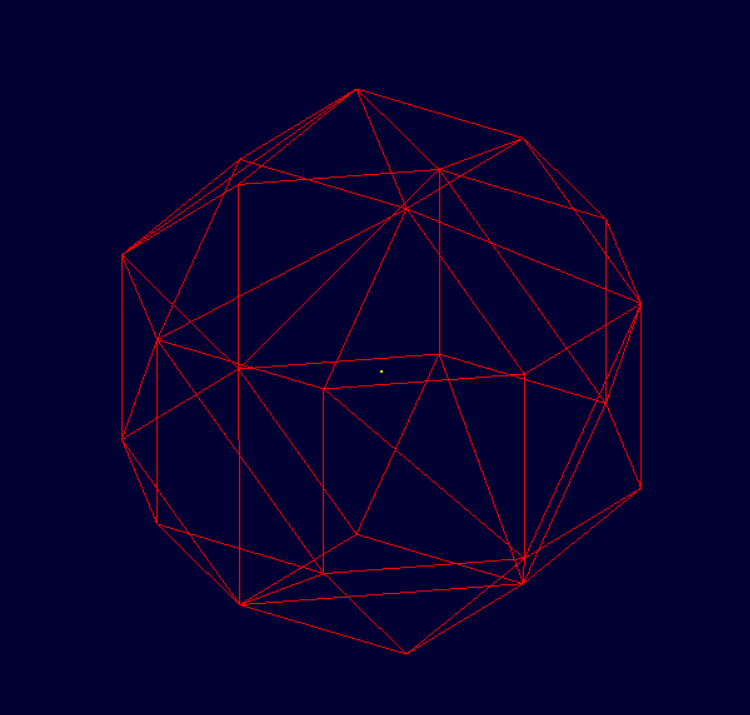

# BRL-CAD Python Bindings

A Python binding prototype for [BRL-CAD](https://brlcad.org/) using CFFI,
exposing BRL-CAD's geometry database to Python via a clean, Pythonic API.

Built **Python Geometry Bindings** project under BRL-CAD by Rohit S.

---

## Architecture

```
User Python code
      ↓
brlcad/ (Pythonic API — Database, GeometryObject, BoundingBox)
      ↓
_brlcad.pyd (CFFI compiled C extension)
      ↓
brlcad_wrap.c (C wrapper over BRL-CAD librt / libwdb)
      ↓
BRL-CAD .g geometry database
```

---

## What It Does

- Opens a BRL-CAD `.g` geometry database from Python
- Lists and queries all objects via clean Python classes
- Returns typed objects (`GeometryObject`) with attributes
- Computes 3D bounding boxes with center and size helpers
- Writes geometry to `.g` via `libwdb` (BOT mesh support)
- Procedural geometry generation from Python (rhombicuboctahedron demo)

---

## Requirements

- BRL-CAD compiled from source (tested on Windows, Visual Studio 2022)
- Python 3.13+
- CFFI (`pip install cffi`)
- scipy (`pip install scipy`) — for rhombicuboctahedron demo only

---

## Build

```powershell
cd D:\python-brlcad
python build_brlcad.py
```

---

## Usage

```python
import brlcad

# Open database
db = brlcad.open("model.g")
print(db)
# → Database(path='model.g', objects=7)

# Query object
obj = db.get("prim_0.s")
print(obj)
# → GeometryObject(name='prim_0.s', type='solid')

# Attributes
print(obj.type)          # → "solid"
print(obj.exists)        # → True

# Bounding box
bbox = obj.bounding_box
print(bbox.min)          # → (-46.0, 13.0, -51.0)
print(bbox.max)          # → (-10.0, 49.0, -15.0)
print(bbox.center)       # → (-28.0, 31.0, -33.0)
print(bbox.size)         # → (36.0, 36.0, 36.0)

# Existence check
db.exists("nonexistent") # → False
db.get_type("random_csg.c") # → "combination"
```

---
## Procedural Geometry Demo

Python-generated rhombicuboctahedron rendered in MGED (24 vertices, 44 faces):



---

## Sample Output

```
Database(path='random_csg.g', objects=7)
📦 Total objects: 7

🔷 GeometryObject(name='prim_0.s', type='solid')
   type  : solid
   bbox  : BoundingBox(min=(-46.0, 13.0, -51.0), max=(-10.0, 49.0, -15.0))
   center: (-28.0, 31.0, -33.0)
   size  : (36.0, 36.0, 36.0)

🔷 GeometryObject(name='random_csg.c', type='combination')
   type  : combination
   bbox  : BoundingBox(min=(-39.0, -20.0, -16.0), max=(18.0, 15.0, 35.0))
   center: (-10.5, -2.5, 9.5)
   size  : (57.0, 35.0, 51.0)

❌ 'nonexistent' not found
```

---

## Procedural Geometry Demo

```powershell
python rhombicuboctahedron.py
```

Generates a mathematically precise rhombicuboctahedron (24 vertices, 44 faces)
as a BRL-CAD BOT primitive, written to `rhombicuboctahedron.g` and renderable in MGED.

---

## Files

| File | Purpose |
|---|---|
| `brlcad/` | Pythonic API package (`Database`, `GeometryObject`, `BoundingBox`) |
| `brlcad_wrap.c` | C wrapper over BRL-CAD `librt` / `libwdb` |
| `brlcad_wrap.h` | Public C API header |
| `build_brlcad.py` | CFFI build script |
| `examples/demo.py` | Clean usage demo |
| `rhombicuboctahedron.py` | Procedural geometry generator demo |
| `random_csg.c` | C procedural generator (also in BRL-CAD PR #224) |

---

Rohit S — GSoC 2026 applicant
